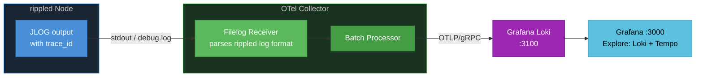

# Phase 8: Log-Trace Correlation and Centralized Log Ingestion — Task List

> **Goal**: Inject trace context (trace_id, span_id) into rippled's Journal log output for log-trace correlation, and add OTel Collector filelog receiver to ingest logs into Grafana Loki for unified observability.
>
> **Scope**: Two independent sub-phases — 8a (code change: trace_id in logs) and 8b (infra only: filelog receiver to Loki). No changes to the `beast::Journal` public API.
>
> **Branch**: `pratik/otel-phase8-log-correlation` (from `pratik/otel-phase7-native-metrics`)

### Related Plan Documents

| Document                                                         | Relevance                                                     |
| ---------------------------------------------------------------- | ------------------------------------------------------------- |
| [06-implementation-phases.md](./06-implementation-phases.md)     | Phase 8 summary and exit criteria (§6.8.1)                    |
| [07-observability-backends.md](./07-observability-backends.md)   | Loki backend recommendation, Grafana data source provisioning |
| [Phase7_taskList.md](./Phase7_taskList.md)                       | Prerequisite — native OTel metrics pipeline must be working   |
| [05-configuration-reference.md](./05-configuration-reference.md) | `[telemetry]` config (trace_id injection toggle)              |

---

## Motivation

### The Problem

rippled emits ~2,242 JLOG calls across 194 files. When investigating an issue (e.g., a consensus failure or a slow RPC), operators must manually correlate timestamps between Jaeger traces and log files — a tedious, error-prone process that loses context.

### What We Gain

1. **One-click trace-to-log correlation** — Grafana's Tempo → Loki link lets operators click a trace span and see all log lines emitted during that span's lifetime. No manual timestamp matching.

2. **Log-to-trace reverse lookup** — An error in the logs like `"Transaction failed"` can be traced back to the exact distributed trace via the `trace_id` field. Grafana Loki's LogQL: `{job="rippled"} |= "trace_id=abc123"`.

3. **Structured log context** — trace_id and span_id make logs queryable by trace, enabling aggregate analysis (e.g., "show all logs for consensus rounds that took >5s").

4. **Zero call-site changes** — The injection happens in `Logs::format()` or `Logs::write()`, transparently to the ~2,242 JLOG call sites.

5. **Centralized log storage** — Loki provides indexed, compressed log retention with LogQL queries, replacing ad-hoc `grep` on individual node log files.

### What We Lose

1. **Slightly larger log lines** — Each log line grows by ~70 characters (`trace_id=<32hex> span_id=<16hex>`). At ~1000 lines/min, this adds ~70 KB/min of log volume.

2. **Thread-local dependency** — trace_id is only available when a span is active on the current thread. JLOG calls outside any span context will have empty trace_id (this is fine — it indicates non-traced code paths).

3. **Loki infrastructure** — Adds another backend (Loki) to the observability stack. Mitigated: Loki is lightweight and can run as a single binary for development.

---

## Architecture

### Phase 8a: Trace ID Injection into Logs

```
Thread with active OTel span:
  JLOG(journal_.info()) << "Processing transaction " << txHash;

Flow:
  1. ScopedStream destructor calls sink.write(severity, text)
  2. Logs::write() calls Logs::format()
  3. format() checks thread-local OTel span context
  4. If span is active: prepends "trace_id=<hex> span_id=<hex>" to message
  5. Output: "2026-03-06T12:34:56.789Z Consensus:INF trace_id=abc123 span_id=def456 Processing transaction ..."
```

**Key design decision**: Inject in `Logs::format()` (the static formatting function) by accessing the thread-local OTel span context via `opentelemetry::trace::GetSpan(opentelemetry::context::RuntimeContext::GetCurrent())`. This is a read-only, lock-free operation.

**Conditional**: Only inject when `[telemetry] enabled=1` and a span is active. When telemetry is disabled at build time (`-Dtelemetry=OFF`), the injection compiles to nothing.

### Phase 8b: Filelog Receiver to Loki



**OTel Collector filelog receiver** parses rippled's log format, extracts `trace_id` and `span_id` as log attributes, and exports to Loki via OTLP. Grafana correlates Tempo traces with Loki logs via the shared `trace_id`.

---

## Task 8.1: Inject trace_id into Logs::format()

**Objective**: Add OTel trace context to every log line that is emitted within an active span.

**What to do**:

- Edit `src/libxrpl/basics/Log.cpp`:
  - In `Logs::format()` (around line 346), after severity is appended, check for active OTel span:
    ```cpp
    #ifdef XRPL_ENABLE_TELEMETRY
    auto span = opentelemetry::trace::GetSpan(
        opentelemetry::context::RuntimeContext::GetCurrent());
    auto ctx = span->GetContext();
    if (ctx.IsValid())
    {
        // Append trace context as structured fields
        char traceId[33], spanId[17];
        ctx.trace_id().ToLowerBase16(traceId);
        ctx.span_id().ToLowerBase16(spanId);
        output += "trace_id=";
        output.append(traceId, 32);
        output += " span_id=";
        output.append(spanId, 16);
        output += ' ';
    }
    #endif
    ```
  - Add `#include` for OTel context headers, guarded by `#ifdef XRPL_ENABLE_TELEMETRY`

- Edit `include/xrpl/basics/Log.h`:
  - No changes needed — format() signature unchanged

**Key modified files**:

- `src/libxrpl/basics/Log.cpp`

**Performance note**: `GetSpan()` and `GetContext()` are thread-local reads with no locking — measured at <10ns per call. With ~1000 JLOG calls/min, this adds <10us/min of overhead.

---

## Task 8.2: Add Loki to Docker Compose Stack

**Objective**: Add Grafana Loki as a log storage backend in the development observability stack.

**What to do**:

- Edit `docker/telemetry/docker-compose.yml`:
  - Add Loki service:
    ```yaml
    loki:
      image: grafana/loki:2.9.0
      ports:
        - "3100:3100"
      command: -config.file=/etc/loki/local-config.yaml
    ```
  - Add Loki as a Grafana data source in provisioning

- Create `docker/telemetry/grafana/provisioning/datasources/loki.yaml`:
  - Configure Loki data source with derived fields linking `trace_id` to Tempo

**Key new files**:

- `docker/telemetry/grafana/provisioning/datasources/loki.yaml`

**Key modified files**:

- `docker/telemetry/docker-compose.yml`

---

## Task 8.3: Add Filelog Receiver to OTel Collector

**Objective**: Configure the OTel Collector to tail rippled's log file and export to Loki.

**What to do**:

- Edit `docker/telemetry/otel-collector-config.yaml`:
  - Add `filelog` receiver:
    ```yaml
    receivers:
      filelog:
        include: [/var/log/rippled/debug.log]
        operators:
          - type: regex_parser
            regex: '^(?P<timestamp>\S+)\s+(?P<partition>\S+):(?P<severity>\S+)\s+(?:trace_id=(?P<trace_id>[a-f0-9]+)\s+span_id=(?P<span_id>[a-f0-9]+)\s+)?(?P<message>.*)$'
            timestamp:
              parse_from: attributes.timestamp
              layout: "%Y-%m-%dT%H:%M:%S.%fZ"
    ```
  - Add logs pipeline:
    ```yaml
    service:
      pipelines:
        logs:
          receivers: [filelog]
          processors: [batch]
          exporters: [otlp/loki]
    ```
  - Add Loki exporter:
    ```yaml
    exporters:
      otlp/loki:
        endpoint: loki:3100
        tls:
          insecure: true
    ```

- Mount rippled's log directory into the collector container via docker-compose volume

**Key modified files**:

- `docker/telemetry/otel-collector-config.yaml`
- `docker/telemetry/docker-compose.yml`

---

## Task 8.4: Configure Grafana Trace-to-Log Correlation

**Objective**: Enable one-click navigation from Tempo traces to Loki logs in Grafana.

**What to do**:

- Edit Grafana Tempo data source provisioning to add `tracesToLogs` configuration:

  ```yaml
  tracesToLogs:
    datasourceUid: loki
    filterByTraceID: true
    filterBySpanID: false
    tags: ["partition", "severity"]
  ```

- Edit Grafana Loki data source provisioning to add `derivedFields` linking trace_id back to Tempo:
  ```yaml
  derivedFields:
    - datasourceUid: tempo
      matcherRegex: "trace_id=(\\w+)"
      name: TraceID
      url: "$${__value.raw}"
  ```

**Key modified files**:

- `docker/telemetry/grafana/provisioning/datasources/loki.yaml`
- `docker/telemetry/grafana/provisioning/datasources/` (Tempo data source file)

---

## Task 8.5: Update Integration Tests

**Objective**: Verify trace_id appears in logs and Loki correlation works.

**What to do**:

- Edit `docker/telemetry/integration-test.sh`:
  - After sending RPC requests (which create spans), grep rippled's log output for `trace_id=`
  - Verify trace_id matches a trace visible in Jaeger
  - Optionally: query Loki via API to confirm log ingestion

**Key modified files**:

- `docker/telemetry/integration-test.sh`

---

## Task 8.6: Update Documentation

**Objective**: Document the log correlation feature in runbook and reference docs.

**What to do**:

- Edit `docs/telemetry-runbook.md`:
  - Add "Log-Trace Correlation" section explaining how to use Grafana Tempo → Loki linking
  - Add LogQL query examples for filtering by trace_id

- Edit `OpenTelemetryPlan/09-data-collection-reference.md`:
  - Add new section "3. Log Correlation" between SpanMetrics and StatsD sections
  - Document the log format with trace_id injection
  - Document Loki as a new backend

- Edit `docker/telemetry/TESTING.md`:
  - Add log correlation verification steps

**Key modified files**:

- `docs/telemetry-runbook.md`
- `OpenTelemetryPlan/09-data-collection-reference.md`
- `docker/telemetry/TESTING.md`

---

## Summary Table

| Task | Description                                | Sub-Phase | New Files | Modified Files | Effort | Risk   | Depends On |
| ---- | ------------------------------------------ | --------- | --------- | -------------- | ------ | ------ | ---------- |
| 8.1  | Inject trace_id into Logs::format()        | 8a        | 0         | 1              | 1d     | Low    | Phase 7    |
| 8.2  | Add Loki to Docker Compose stack           | 8b        | 1         | 1              | 0.5d   | Low    | —          |
| 8.3  | Add filelog receiver to OTel Collector     | 8b        | 0         | 2              | 1d     | Medium | 8.1, 8.2   |
| 8.4  | Configure Grafana trace-to-log correlation | 8b        | 0         | 2              | 0.5d   | Low    | 8.3        |
| 8.5  | Update integration tests                   | 8a + 8b   | 0         | 1              | 0.5d   | Low    | 8.4        |
| 8.6  | Update documentation                       | 8a + 8b   | 0         | 3              | 1d     | Low    | 8.5        |

**Total Effort**: 4.5 days

**Parallel work**: Task 8.2 (Loki infra) can run in parallel with Task 8.1 (code change). Tasks 8.3-8.6 are sequential.

**Exit Criteria** (from [06-implementation-phases.md §6.8.1](./06-implementation-phases.md)):

- [ ] Log lines within active spans contain `trace_id=<hex> span_id=<hex>`
- [ ] Log lines outside spans have no trace context (no empty fields)
- [ ] Loki ingests rippled logs via OTel Collector filelog receiver
- [ ] Grafana Tempo → Loki one-click correlation works
- [ ] Grafana Loki → Tempo reverse lookup works via derived field
- [ ] Integration test verifies trace_id presence in logs
- [ ] No performance regression from trace_id injection (< 0.1% overhead)
